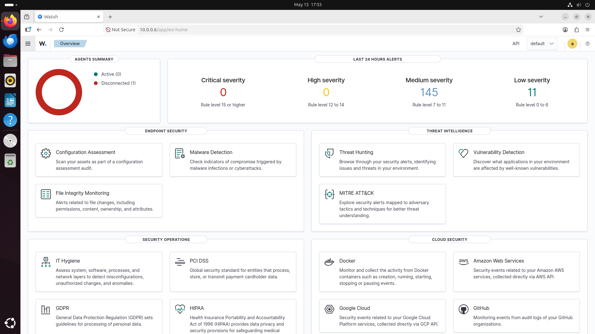
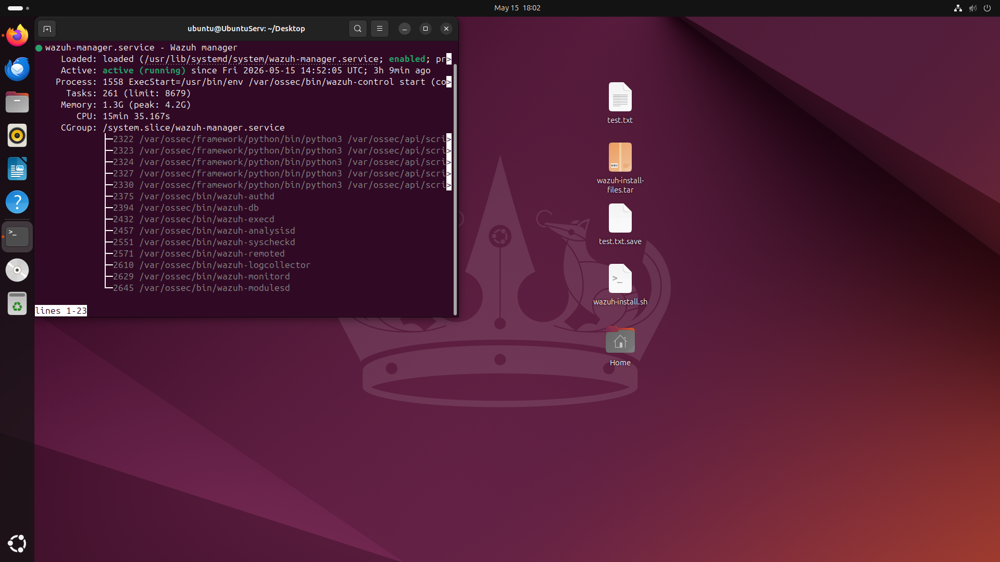
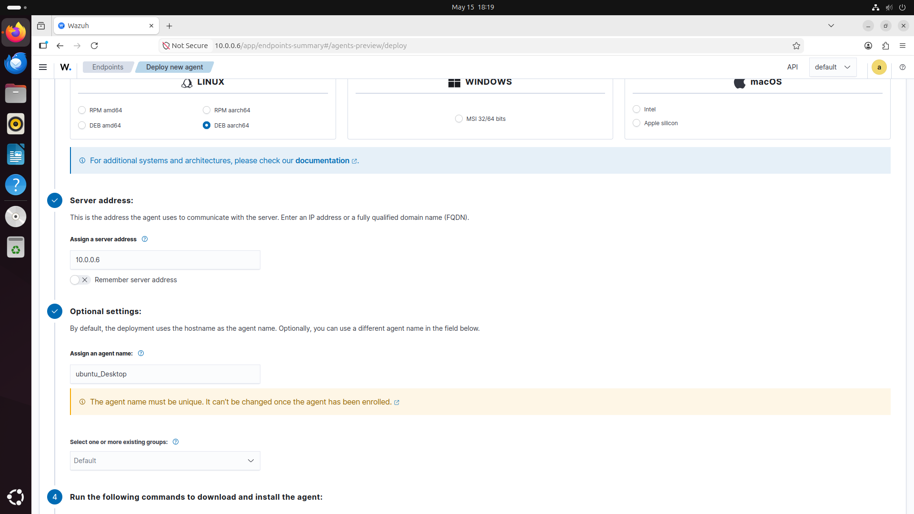
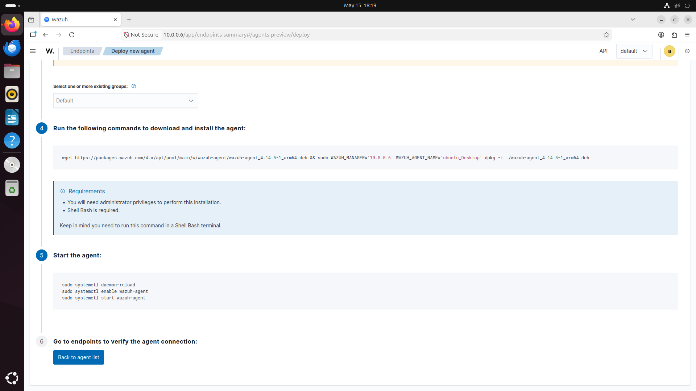

# Suricata and Wazuh Homelab Project

## Overview

This project demonstrates the deployment of a cybersecurity monitoring environment using Wazuh and Suricata inside a VirtualBox lab. The environment is designed to simulate a small Security Operations Center (SOC) workflow where network traffic is monitored, analyzed, and visualized through a centralized dashboard.

Wazuh is used as the SIEM and endpoint monitoring platform, while Suricata functions as the network intrusion detection system (IDS). Kali Linux is used to simulate attacks against monitored systems.

The objective of this project is to gain hands-on experience with:

* SIEM deployment
* Network intrusion detection
* Endpoint monitoring
* Log analysis
* Attack simulation
* Alert correlation
* Linux administration

---

# Lab Environment

| System         | Role                 | IP Address    |
| -------------- | -------------------- | ------------- |
| Ubuntu Server  | Wazuh Server         | 10.0.0.6 |
| Ubuntu Desktop | Suricata Sensor      | 10.0.0.7|
| Windows 11     | Wazuh Agent Endpoint | 192.168.56.30 |
| Kali Linux     | Attacker Machine     | 10.0.0.8 |

Network Type: Bridged Adapter

---

# Hardware Requirements

| Component      | Minimum Requirement |
| -------------- | ------------------- |
| CPU            | Quad-Core Processor |
| RAM            | 16 GB Recommended   |
| Storage        | 120 GB Free Space   |
| Virtualization | Enabled in BIOS     |
| Hypervisor     | Oracle VirtualBox   |

---

# Software Requirements

* VirtualBox
* Ubuntu Server 24.04
* Ubuntu Desktop 24.04
* Windows 11 ISO
* Kali Linux ISO
* Wazuh
* Suricata
* Nmap
* Hydra

---

## Create Ubuntu Server VM

Configuration:

* Name: Wazuh-Server
* RAM: 8 GB
* CPU: 4 Cores
* Storage: 60 GB
* Network Adapter: Host-Only Adapter

Install Ubuntu Server.

---

## Create Ubuntu Desktop VM

Configuration:

* Name: Suricata-Sensor
* RAM: 4 GB
* CPU: 2 Cores
* Storage: 40 GB
* Network Adapter: Host-Only Adapter


```

---

## Create Windows 11 VM

Configuration:

- RAM: 4 GB
- CPU: 2 Cores
- Storage: 50 GB
- Network Adapter: Host-Only Adapter

```

---

## Create Kali Linux VM

Configuration:

* RAM: 4 GB
* CPU: 2 Cores
* Storage: 30 GB
* Network Adapter: Host-Only Adapter


````

---

# Installing Wazuh on Ubuntu Server

Update system:

```bash
sudo apt update && sudo apt upgrade -y
````

Download Wazuh installation script:

```bash
curl -sO https://packages.wazuh.com/4.x/wazuh-install.sh
```

Run installation:

```bash
sudo bash wazuh-install.sh -a
```

This installs:

* Wazuh Manager
* Wazuh Indexer
* Wazuh Dashboard
* Filebeat

Installation may take several minutes.

---

# Accessing Wazuh Dashboard

After installation, access the dashboard from a browser:

```text
https://"your IP address"
```
In my case it's 10.0.0.6

Default credentials are displayed at the end of installation.

Example:

```text
Username: admin
Password: generated_password
```

---

# Verify Wazuh Services

Check Wazuh manager:

```bash
sudo systemctl status wazuh-manager
```



Check Wazuh dashboard:

```bash
sudo systemctl status wazuh-dashboard
```

Check Wazuh indexer:

```bash
sudo systemctl status wazuh-indexer
```

---

# Installing Suricata on Ubuntu Desktop

Update system:

```bash
sudo apt update && sudo apt upgrade -y
```

Install Suricata:

```bash
sudo apt install suricata -y
```

Verify installation:

```bash
suricata --build-info
```

---

# Configure Suricata Network Interface

Identify interface:

```bash
ip a
```

Edit configuration:

```bash
sudo nano /etc/suricata/suricata.yaml
```

Locate:

```yaml
af-packet:
  - interface: eth0
```

Replace `eth0` with the correct interface name.

---

# Configure HOME_NET

Locate:

```yaml
HOME_NET: "[10.0.0.0/24]"
```

This tells Suricata to monitor the entire VirtualBox lab network.

---

# Enable EVE JSON Logging

Locate:

```yaml
outputs:
  - eve-log:
      enabled: yes
      filename: eve.json
```

EVE JSON logs are required for Wazuh integration.

---

# Verify Suricata Configuration

Run configuration test:

```bash
sudo suricata -T -c /etc/suricata/suricata.yaml -v
```

Expected output:

```text
Configuration provided was successfully loaded.
```

---

# Start Suricata

Enable service:

```bash
sudo systemctl enable suricata
```

Start service:

```bash
sudo systemctl start suricata
```

Verify status:

```bash
sudo systemctl status suricata
```
Please refer to my IDS project to learn how to properly install and setup suricata and create custom rules.
[Suricata-IDS-IPS-Homelab-Project](https://github.com/MacintoshFa/Suricata-IDS-IPS-Homelab-Project.git)

---

# Deploy ubuntu Desktop Agent on Wazuh Dashboard

How to Deploy Ubuntu Desktop Agent on Wazuh Dashboard

Deployment Steps

1. Access Wazuh Dashboard

1. Open Wazuh Dashboard in your web browser
2. Navigate to Endpoints → Deploy new agent
3. Confirm you're on the "Deploy new agent" tab


2. Select Linux Agent Architecture
Choose the appropriate package for your system:


|Package Type   |Use Case                                 |
|---------------|-----------------------------------------|
|**DEB amd64**  |64-bit Intel/AMD processors (most common)|
|**DEB aarch64**|ARM-based systems (shown in example)     |
|RPM amd64      |64-bit RedHat/CentOS systems             |
|RPM aarch64    |ARM-based RedHat/CentOS systems          |

Example: Select DEB aarch64 for ARM-based Ubuntu systems


3. Configure Server Address

Field: Assign a server address

Value: 10.0.0.6 (or your Wazuh Manager IP/FQDN)

Option: Check "Remember server address" to save for future deployments


4. Set Agent Name

Field: Assign an agent name

Default: Uses system hostname

Example: ubuntu_Desktop

Note: Agent name must be unique and cannot be changed after enrollment


5. Select Agent Groups

Field: Select one or more existing groups
Example: Default
Purpose: Organize and manage agent policies


6. Execute Installation Commands
   
Copy and run the provided installation commands on your Ubuntu system:

# Commands will be displayed in the dashboard

 Example structure:
 
# curl -s <download_url> | sudo bash




sudo systemctl start wazuh-agent


sudo systemctl enable wazuh-agent


7. Verify Agent Enrollment

1. Return to Wazuh Dashboard
2. Check Agents list for your ubuntu_Desktop agent
3. Confirm status shows "Active"

​​​​​​​​​

---

# Configure Suricata Log Monitoring

Inside `ossec.conf`, add:

```xml
<localfile>
  <log_format>json</log_format>
  <location>/var/log/suricata/eve.json</location>
</localfile>
```

This allows Wazuh to ingest Suricata alerts.

---

# Start Wazuh Agent

Enable agent:

```bash
sudo systemctl enable wazuh-agent
```

Start agent:

```bash
sudo systemctl start wazuh-agent
```

Verify status:

```bash
sudo systemctl status wazuh-agent
```

---
#


# Create Custom Suricata Rules

Rule location:

```bash
sudo nano /etc/suricata/rules/local.rules
```

---

## Detect ICMP Ping

```bash
alert icmp any any -> any any (msg:"ICMP Ping Detected"; sid:1000001; rev:1;)
```

---

## Detect Nmap Scan

```bash
alert tcp any any -> any any (msg:"Possible Nmap Scan"; flags:S; threshold:type threshold, track by_src, count 20, seconds 10; sid:1000002; rev:1;)
```

---

## Detect SSH Brute Force

```bash
alert tcp any any -> any 22 (msg:"Possible SSH Brute Force"; flow:to_server; threshold:type both, track by_src, count 5, seconds 60; sid:1000003; rev:1;)
```

Restart Suricata:

```bash
sudo systemctl restart suricata
```

---

# Attack Simulation

## Ping Test

From Kali Linux:

```bash
ping 192.168.56.20
```

Expected Result:

* Suricata generates ICMP alert
* Wazuh dashboard displays event

---

## Nmap Scan Test

```bash
nmap -sS 192.168.56.20
```

Expected Result:

* SYN scan detected
* Alert visible in Wazuh dashboard

---

## SSH Brute Force Test

```bash
hydra -l root -P rockyou.txt ssh://192.168.56.30
```

Expected Result:

* Multiple authentication attempts detected
* Suricata alerts forwarded to Wazuh

---

# Monitoring Alerts

## Suricata Logs

```bash
sudo tail -f /var/log/suricata/fast.log
```

JSON logs:

```bash
sudo tail -f /var/log/suricata/eve.json
```

---

# Wazuh Dashboard Monitoring

Navigate to:

```text
Security Events → Suricata Alerts
```

Dashboard visibility includes:

* Source IP address
* Destination IP address
* Alert severity
* Rule signature
* Timestamp
* Event category

---

# Example Alert

```json
{
  "event_type": "alert",
  "src_ip": "192.168.56.40",
  "dest_ip": "192.168.56.20",
  "alert": {
    "signature": "Possible Nmap Scan"
  }
}
```

---

# Skills Demonstrated

* SIEM deployment
* IDS configuration
* Endpoint monitoring
* Linux administration
* Network security monitoring
* Threat detection
* Log analysis
* Alert correlation
* VirtualBox networking

---

# Challenges Encountered

* Configuring network interfaces
* Troubleshooting Suricata YAML syntax
* Registering Wazuh agents
* Forwarding JSON logs correctly
* Managing firewall and connectivity issues

---

# Future Improvements

* Configure Suricata IPS mode
* Integrate pfSense firewall
* Add ELK Stack visualization
* Create automated response rules
* Monitor Windows event logs
* Deploy additional endpoints

---

# Repository Structure

```text
suricata-wazuh-homelab/
├── screenshots/
├── suricata/
│   ├── suricata.yaml
│   └── local.rules
├── wazuh/
│   └── ossec.conf
├── logs/
├── attack-simulation/
└── README.md
```

---

# Screenshots to Include

* VirtualBox network settings
* Wazuh dashboard home screen
* Active Wazuh agents
* Suricata service status
* Custom Suricata rules
* Nmap attack simulation
* Wazuh security alerts
* Suricata fast.log output

---

# Resume Project Description

Built a cybersecurity homelab integrating Suricata IDS with Wazuh SIEM using VirtualBox and Ubuntu systems. Configured centralized log collection, network intrusion detection, endpoint monitoring, and alert visualization. Simulated attacks using Kali Linux to validate detection and monitoring capabilities.

---

# Author

Your Name

Cybersecurity Student | SOC Analyst Aspirant | Homelab Enthusiast
